## Instructions for setting up a MERN stack development workstation

- Introduction
The following steps create the development environment on your workstation for developing an MERN stack (MYSql, Express, React and Node) application. You will access a repository on github and modify it, run it and push changes back to github. We will be using an empty 'Windows Pro N' VM in these instructions. You should be able to use any workstation. Just follow the steps. 

## Steps to set up your development workstation
###    1. Install any updates to your workstation.

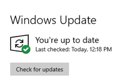

###    2. Create two folders:
```
 'repos' (local copies of your gitHub repos)
 'remotes' (local copies of remote server files)
```


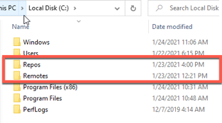

###    3. Install or open Chrome browser

1. Install Extensions:

        1. React Developers Tools
        2. Markdown Preview Plus
            1. Turn on: Allow access to file URLs in Markdown Preview Plus settings

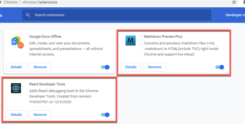


###    4. Create an account or sign into GitHub
1. Create a new repository: 'myProject'. 
2. Select Private and check ReadMe file. 

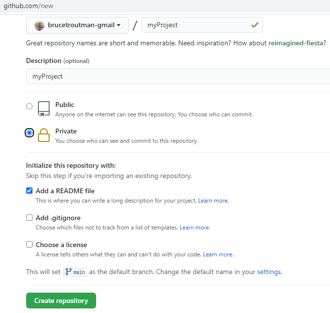

3. Change the Readme.md file to: 
```
# myProject was created on mm/dd/yyyy.
```
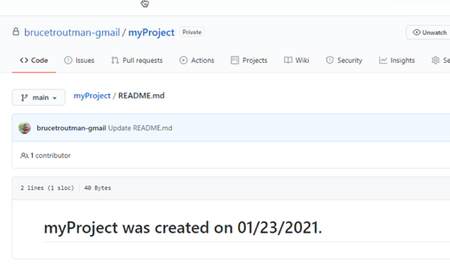

###    5. Install GitHub Desktop and Clone myProject
1. Follow the instructions at: https://docs.github.com/en/desktop/installing-and-configuring-github-desktop/installing-github-desktop


2. Clone myProject
    1. Login to your GitHub account        
    2. From Let's get started select Clone a repository
    3. Select your myProjects repo
    4. Set the local path to your Repos folder from Step 2 above
    5. Click Clone
    6. Validate that the cloning was successful

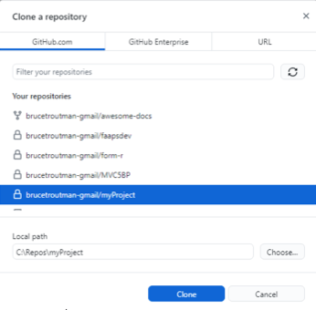

###    6. Download Git, if not already installed
1. Download from http://git.scm.com
2. Select all the default values

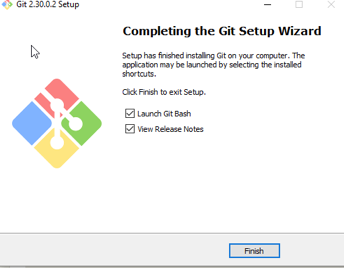

###    7. Open or Install VSCode


1. Pin it to Task Bar 
2. Install Extensions
    1. GitLens
    2. Prettier
    3. React Snippets
2. Click File.. AutoSave
3. Click File.. Open folder : repos/myproject
4. Click File.. Save Workspace as: myProject
5. Close VSCode
6. From File Explorer click on repos/myproject/myProject.code-workspace. VSCode will open to your local myProject code

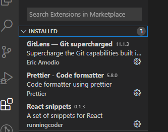

###    8. Markdown Preview test
1. Open VSCode
2. Click on the ReadMe.md file and add:
```
    1. My first update was changed locally.
    
    2. I previewed it in VSCode and Chrome.
```
6. Click View.. Command Palette
7. Type: >Markdown: Open Preview to the Side, your preview will display.
8. From File Explorer right click on Readme.md and open with Chrome, your preview will display.

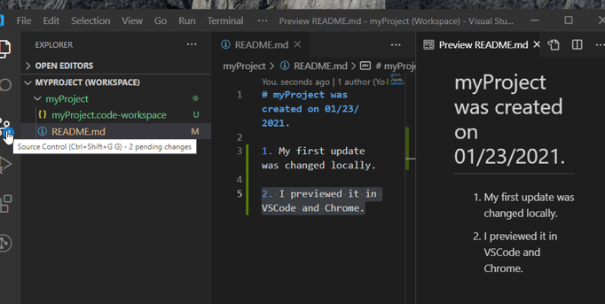


###    9. Push to GitHub
1. From VSCode.. Click the Control Source icon with the 2
2. In the Message textbox, type: Updated Readme.md
3. Click on the checkmark above the Message textbox and enter "Updated Readme.md"

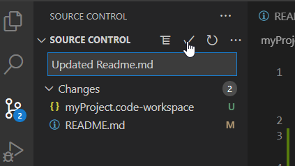

4. Click the Synchronize icon o the left bottom of the VSCode window. You will be asked to login with your GitHub credentials.

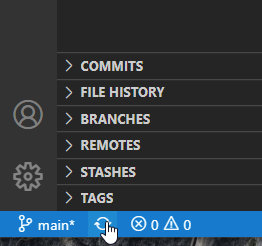

5. Login to GitHub
    1. Select the myProject repository
    2. Click Readme.md, it should be updated.

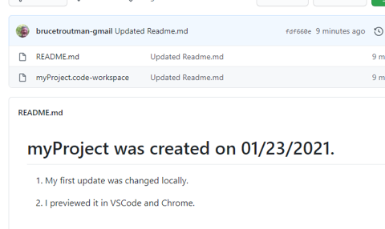

6. Modify Readme.md in Github by adding these lines:
    ```
    3. I updated it in GitHub.

    4. I pulled it to my local repo using VScode
    ``` 
    then Commit the change.

7. In VSCode, From the Source Control menu, click the three dots (...) More menu, and click Pull. 

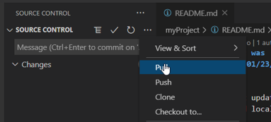

8. The Github changes will now appear in the Readme.md file.

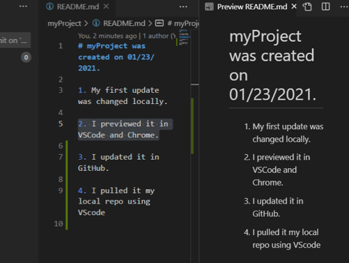
###    10. Install Node for Windows
1. Browse to: nodejs.org/en/downloads
2. Install using all the defaults.

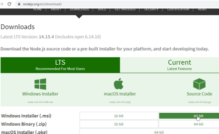

3. Test from Windows command prompt:
```
    node --version
    npm --version
```    
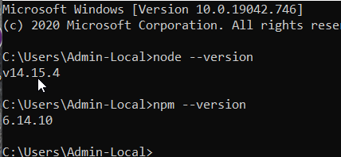


###    11. Install MySql for windows 
1. Follow the instructions at: https://dev.mysql.com/doc/mysql-windows-excerpt/5.7/en/windows-installation.html
2. Choose the version: mysql-installer-community-8.0.23.0.msi


3. Select No, thanks, just start my download

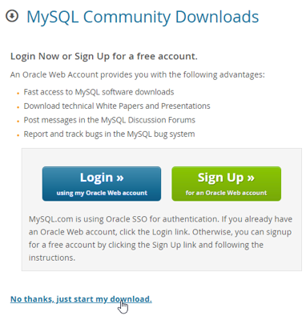

4. Choose Stup Type: Custom

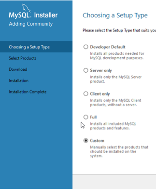

5. Select Products (Version = 8.0.23 -x64)
    1. MySQL Server
    2. MySQL Workbench
    3. MySQL Shell
    4. MySQL Router
    5. Connector/ODBC
    6. Connector/J
    7. MySQL Documentation
    8. Samples and Examples


6. Enter Account password


7. Connect to Server

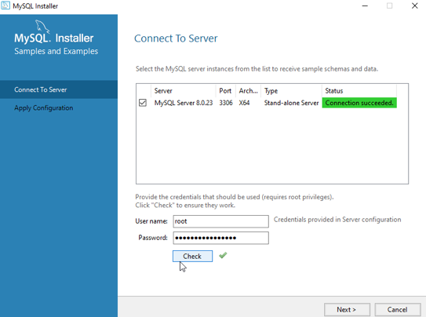

8. Windows Service

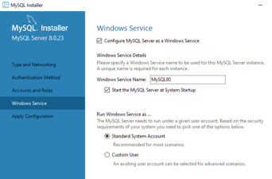

9. Apply Configuration


10. Installation Complete


11. Open MySQL Shell and MySQL WorkBench.

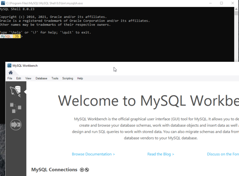

12. WorkBench login

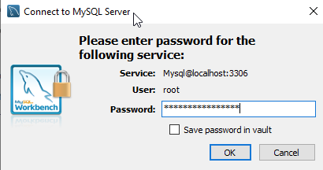

13. WorkBench SHOW DATABASES


14. Shell login


15. Shell SHOW DATABASES


###    12. Install BitVise ssh client and Pin to Task Bar
1. Install Bitvise from: https://www.bitvise.com/ssh-client-download


2. Accept the defaults.


###    13. Install TextPad
1. Install Textpad from: https://www.textpad.com/download#TextPad851


2. Accept the defaults.

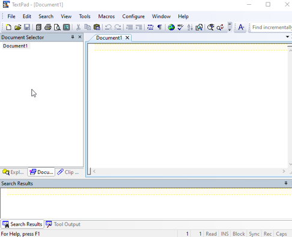

## After all installations  27GB was used on Drive C:.
    